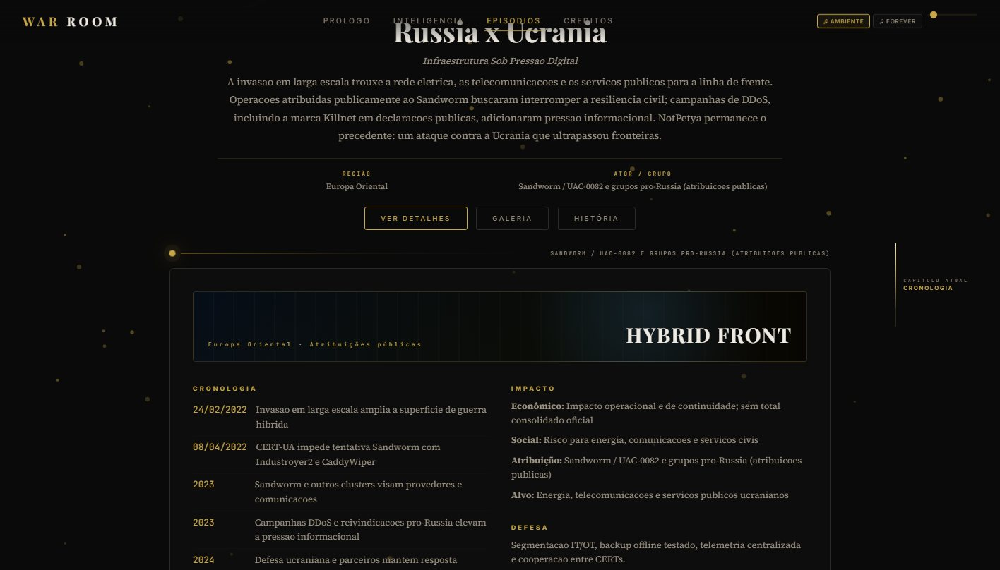
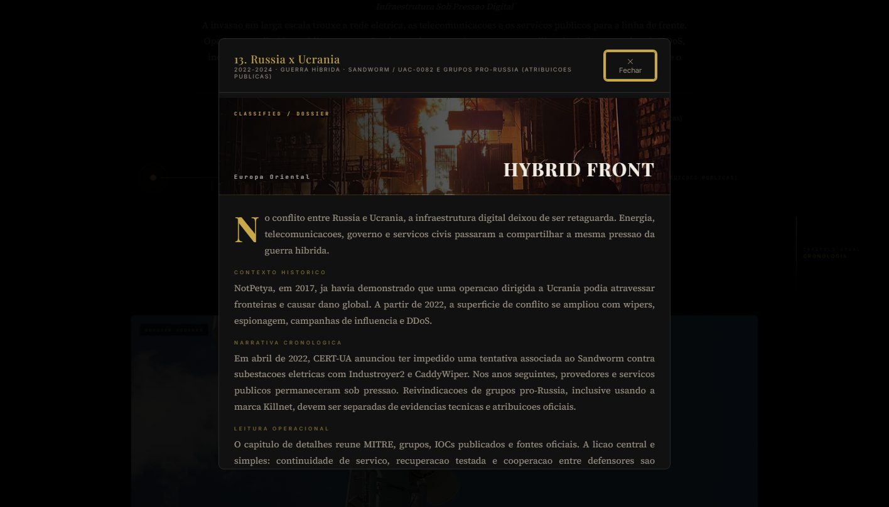

<p align="center">
  <a href="https://edy075.github.io/WAR_ROOM/"></a>
  <a href="https://github.com/EDY075/WAR_ROOM/releases/tag/v1.0.3"></a>
  
  
</p>

# WAR ROOM

## Biblioteca cinematográfica de conflitos cibernéticos

WAR ROOM é uma experiência interativa sobre conflitos cibernéticos que combina narrativa histórica, inteligência de ameaças pública, investigação visual e contexto operacional. O projeto apresenta 17 dossiês — do Morris Worm às campanhas modernas envolvendo Rússia × Ucrânia, Volt Typhoon, Salt Typhoon, Lazarus Group e Israel × Irã.

Criado por [Edmilson Gomes](https://github.com/EDY075) · [LinkedIn](https://linkedin.com/in/edmilson-gomes) para portfólio e pesquisa acadêmica em **Cybersecurity**, **Blue Team**, **Threat Intelligence** e **Incident Response**.

## Demonstração

<p align="center">
  <a href="https://edy075.github.io/WAR_ROOM/"></a>
</p>

Explore a experiência completa em [edy075.github.io/WAR_ROOM](https://edy075.github.io/WAR_ROOM/).

## Screenshots

<p align="center">
  
  
</p>

<p align="center">
  
</p>

<p align="center">
  
  
</p>

## Principais Recursos

- 17 casos históricos e modernos de conflitos cibernéticos.
- Intelligence Center com visão transversal dos dossiês.
- Linha do tempo global de 1988 a 2025.
- Mapa mundial interativo com hotspots de campanhas.
- Contexto MITRE ATT&CK, grupos APT e indicadores públicos.
- IOC Explorer e filtros por país, ano, categoria, impacto, grupo e malware.
- Galeria multimídia, mapas regionais, referências e créditos visuais.
- Storytelling cinematográfico com cronologias e modal narrativo.
- Interface responsiva, navegação por teclado e suporte a `prefers-reduced-motion`.
- Funciona sem build, backend ou instalação de dependências.

## Intelligence Center

Uma central de análise client-side que conecta os 17 dossiês por geografia, período, impacto, grupos, técnicas MITRE e indicadores públicos. O mapa, a linha do tempo e os explorers permitem navegar do panorama global ao capítulo correspondente sem sair da experiência.

## Biblioteca de Casos

Os dossiês cobrem incidentes como Morris Worm, Melissa, ILOVEYOU, Estônia 2007, Stuxnet, Sony Pictures, WannaCry, NotPetya, SolarWinds, Colonial Pipeline, Log4Shell e MGM Resorts, além de cinco conflitos modernos: Rússia × Ucrânia, Volt Typhoon, Salt Typhoon, Lazarus Group e Israel × Irã.

As referências são apresentadas como inteligência pública, com atribuições e indicadores tratados com contexto e créditos em [assets/images/CREDITS.md](assets/images/CREDITS.md).

## Tecnologias

- HTML5, CSS3 e JavaScript nativo.
- Canvas API, Web Audio API e IntersectionObserver.
- GitHub Pages para publicação.
- [Wikimedia Commons](https://commons.wikimedia.org/) e fontes públicas de threat intelligence, incluindo [MITRE ATT&CK](https://attack.mitre.org/), [CISA](https://www.cisa.gov/), [NSA](https://www.nsa.gov/), [CERT-UA](https://cert.gov.ua/), [FBI](https://www.fbi.gov/), [NIST](https://www.nist.gov/) e [Kaspersky](https://www.kaspersky.com/resource-center).

## Como executar

# Como executar

O WAR ROOM é uma aplicação estática e não requer instalação de dependências.

### Opção 1 — Abrir diretamente (recomendado)

Basta abrir o arquivo `index.html` em qualquer navegador moderno.

- ✅ Google Chrome
- ✅ Microsoft Edge
- ✅ Mozilla Firefox
- ✅ Brave
- ✅ Opera

### Opção 2 — Servidor local (opcional)

Caso prefira executar através de um servidor HTTP local:

```bash
python -m http.server
```

Depois acesse:

```
http://127.0.0.1:8000
```

---

**GitHub Pages**

## 🌐 Acessar online

https://edy075.github.io/WAR_ROOM/

## Licença

Distribuído sob a [MIT License](LICENSE).
