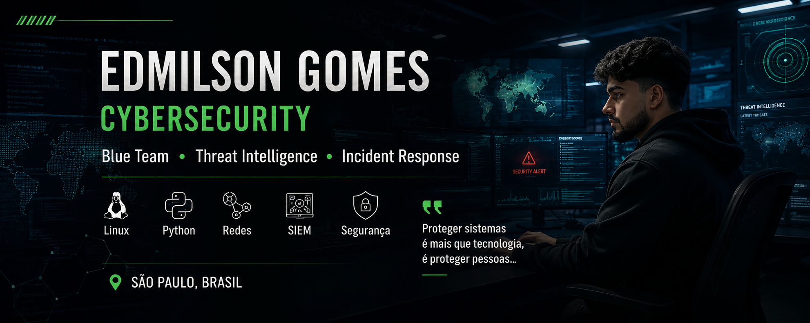
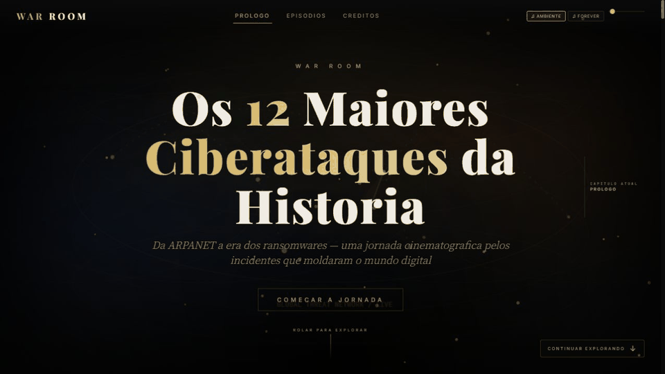
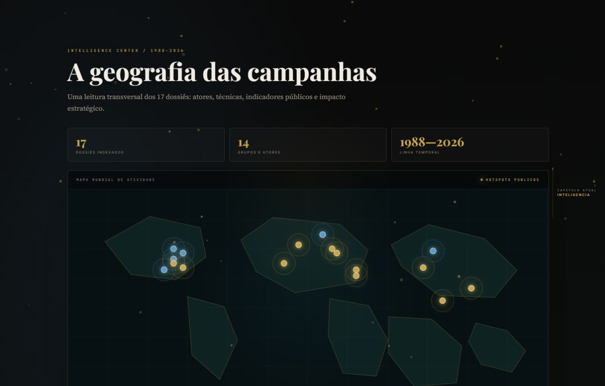
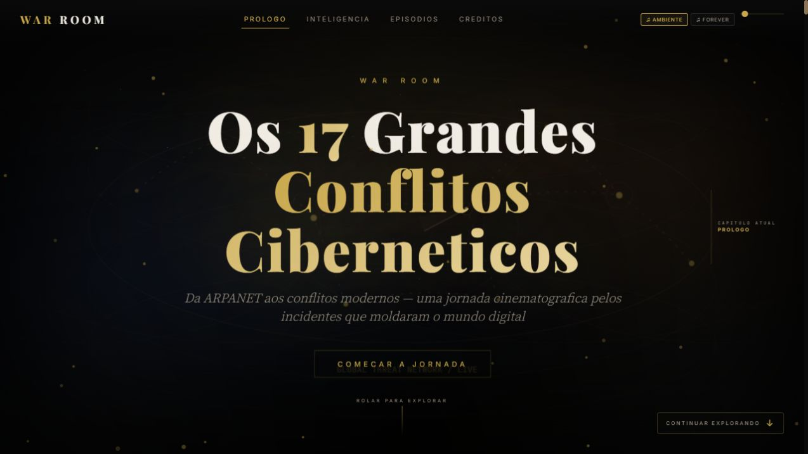
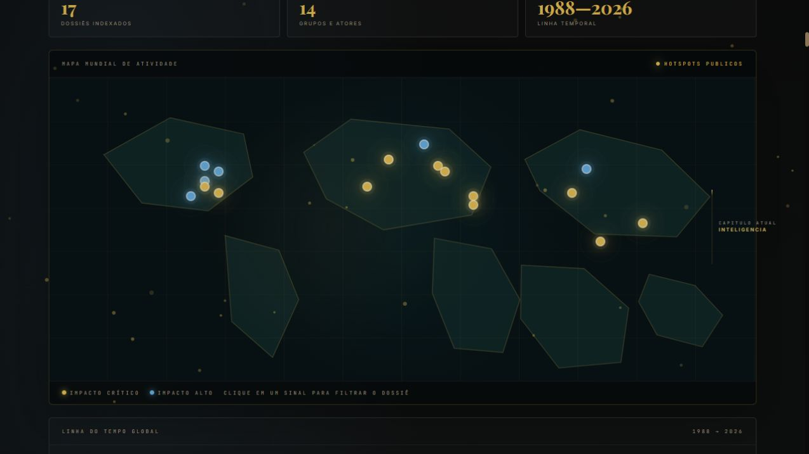
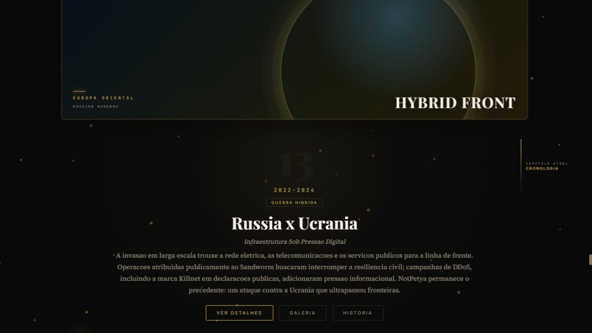

<p align="center">


</p>

# WAR ROOM v1.0

**Interactive Cyber Attack Timeline**

Sprint 2 adds a low-overhead cinematic navigation layer: tactical map pulses, chapter progress, refined hover states, natural ambient depth, and `prefers-reduced-motion` support.

Sprint 3 expands WAR ROOM into a 17-chapter cyber-conflict library. Five modern dossiers cover Russia x Ukraine, Volt Typhoon, Salt Typhoon, Lazarus Group, and Israel x Iran with timelines, MITRE ATT&CK, public IOCs, lessons learned, and links to primary sources.

Sprint 3.5 gives those five dossiers a visual treatment at the same level as the classic chapters: distinct tactical covers, internal dossier banners, illustrated timeline markers, contextual media, and regional maps. Every gallery item shows a Wikimedia Commons credit, with source and license links in the detail panel.

Sprint 4 introduces the **Intelligence Center**: a cinematic, client-side analysis layer over the same 17 dossiers. It adds an interactive world map, a 1988–2026 global timeline, MITRE/APT/IOC explorers, cross-campaign links, and combinable filters without changing episode content.

Sprint 5.1 standardizes the portfolio reading experience across all 17 chapters. “Começar a Jornada” now lands directly in the Intelligence Center, every dossier uses the same card and detail frame, and the five modern dossiers use local, credited visual assets. See [visual credits](assets/images/CREDITS.md) and run `node tests/verify-final-consistency.mjs` for the static release check.

## Continuidade por IA

Qualquer agente pode assumir o projeto lendo apenas a pasta [`.ai/`](.ai/). Ela é a fonte oficial de contexto, arquitetura, estado atual, decisões, fluxo de validação, memória técnica e roadmap do WAR ROOM.

## Intelligence Center

- Interactive world map with 17 attack hotspots and impact signal levels
- Global timeline (1988–2026) that filters the dossier index
- Filters for country, year, category, impact, group, and malware
- MITRE ATT&CK, APT Group, and safe public-IOC explorers
- Premium hover states and keyboard-accessible cards that open the corresponding episode
- Mobile-responsive layout and `prefers-reduced-motion` support

## Modern Conflict Dossiers

| Chapter | Focus | Visual dossier | Primary sources |
| --- | --- | --- | --- |
| Russia x Ukraine | Hybrid warfare, Sandworm, critical infrastructure | Infrastructure image + Ukraine power-grid map | CERT-UA, MITRE |
| Volt Typhoon | Critical infrastructure, stealth, living off the land | Telecom image + Guam locator map | CISA, NSA, FBI, MITRE |
| Salt Typhoon | Telecommunications and global espionage | Cell-tower image + China map | CISA, FBI, MITRE |
| Lazarus Group | Cryptocurrency, supply chain, state financing | Crypto-mining image + DPRK map | CISA, FBI, Treasury, MITRE |
| Israel x Iran | ICS, PLCs, public attribution and resilience | PLC image + Israel/Iran locator map | CISA, INCD, MITRE |

---

## 📖 Descrição

O WAR ROOM é uma biblioteca cinematográfica interativa de 17 incidentes e conflitos cibernéticos, de 1988 a 2025 — do Morris Worm aos dossiês de conflitos modernos.

O projeto foi desenvolvido como trabalho acadêmico de cibersegurança e combina storytelling imersivo com uma experiência visual de alto nível: cada episódio traz cronologia, impacto econômico e social, atribuição, defesa, legislação, galeria de imagens e uma narrativa completa em modal.

Tudo em um único arquivo HTML autocontido, sem dependências de build.

---

## 🌐 Demonstração

<p align="center">
  <a href="https://edy075.github.io/WAR_ROOM/">
    
  </a>
</p>

<p align="center">

</p>

---

## Screenshots da Release

<p align="center">
  
</p>

<p align="center">
  
  
</p>

<p align="center">
  
</p>

---

## ✨ Funcionalidades

- 🎬 **17 episódios interativos** — linha do tempo de ataques e conflitos cibernéticos (1988–2025)
- 📜 **Narrativa completa** — história detalhada de cada ataque em modal cinematográfico
- 🗓️ **Cronologia interativa** — datas-chave de cada incidente
- 📊 **Impacto detalhado** — econômico, social, atribuição, alvo, defesa e legislação
- 🖼️ **Galeria com lightbox** — visualizador de imagens com crossfade, navegação por teclado e swipe no mobile
- 🎵 **Trilha sonora** — música "Forever" via SoundCloud e áudio ambiente procedural (Web Audio API)
- 🔊 **Controle de volume** — slider de volume para a trilha
- 🔗 **Compartilhamento** — botão para compartilhar a experiência
- 💾 **Preferências salvas** — volume e configurações persistidas via localStorage
- 📱 **Totalmente responsivo** — desktop, notebook, tablet e mobile
- ♿ **Acessibilidade** — skip-link, navegação por teclado, focus trap, suporte a `prefers-reduced-motion`
- 🎥 **Efeitos visuais** — partículas, waves canvas, film grain, parallax e loading screen cinematográfico

---

## 🛠️ Tecnologias

- **HTML5** — estrutura semântica e acessível
- **CSS3** — design tokens, variáveis, grid, media queries e animações
- **JavaScript (ES5/ES6)** — lógica da aplicação
- **Canvas API** — partículas, ondas e film grain em tempo real
- **Web Audio API** — áudio ambiente procedural
- **IntersectionObserver** — animações de scroll e scroll-spy
- **SoundCloud API** — player da trilha sonora
- **Google Fonts** — Playfair Display, Source Serif 4, JetBrains Mono e Inter
- **Wikimedia Commons** — imagens históricas licenciadas

---

## 📂 Estrutura do Projeto

```
WAR_ROOM/
├── index.html              ← Aplicação principal (autocontida)
├── banner-github.png       ← Banner do repositório
├── README.md               ← Este arquivo
├── LICENSE                 ← Licença MIT
├── .gitignore              ← Arquivos ignorados pelo Git
├── assets/
│   ├── audio/              ← (estrutura)
│   ├── data/               ← (estrutura)
│   ├── images/             ← Imagens locais (ep01_morris)
│   └── video/              ← (estrutura)
├── episodes/               ← Textos-fonte dos 12 episódios clássicos (EP01–EP12)
└── archive/                ← Versões antigas e arquivos preservados
```

---

## 🚀 Como Executar

### Local (sem instalação)

1. **Windows**: dê dois cliques em `index.html`
2. **Mac/Linux**: abra o `index.html` em qualquer navegador moderno
3. **Celular/Tablet**: transfira a pasta e abra o `index.html` no Chrome/Safari

> Funciona em qualquer navegador moderno (Chrome, Firefox, Edge, Safari).
> O conteúdo principal é local — apenas imagens e fontes carregam da web.

### Deploy (Netlify / GitHub Pages)

1. Suba o repositório para o GitHub
2. No Netlify: arraste a pasta `WAR_ROOM` para o deploy (ou conecte o repositório)
3. No GitHub Pages: aponte para `main` / raiz — o `index.html` será servido automaticamente

---

## 🗺️ Roadmap

### ✅ Concluído
- 17 episódios, incluindo cinco dossiês modernos (1988–2025), com fontes primárias vinculadas
- Narrativas imersivas para todos os episódios
- Galeria de imagens com lightbox e crossfade
- Áudio ambiente procedural + trilha via SoundCloud
- Controle de volume e preferências persistentes
- Design responsivo e acessível
- Otimizações de performance (lazy loading, reduced-motion)
- Publicação online no GitHub Pages ([edy075.github.io/WAR_ROOM](https://edy075.github.io/WAR_ROOM/))

### 🚧 Em desenvolvimento
- Links profissionais no rodapé (GitHub / LinkedIn)

### 🔮 Futuras melhorias
- Expandir dossiês modernos com novas fontes primárias verificadas
- Versão em inglês (i18n)
- Modo claro/escuro
- PWA (instalação como app)
- Auditoria Lighthouse e otimização de Core Web Vitals

---

## 📜 Licença

Distribuído sob a licença **MIT**. Veja o arquivo [LICENSE](LICENSE) para mais detalhes.

Imagens via Wikimedia Commons (domínio público / licenciadas).
Música: "Forever (Single Version)" — The Little Dippers via SoundCloud.

---

## 👤 Autor

**Edmilson Gomes** — Estudante de Cibersegurança

[](https://github.com/EDY075) [](https://www.linkedin.com/in/edmilsongomes21/) [](https://www.instagram.com/edmilson_zn_/)

---


