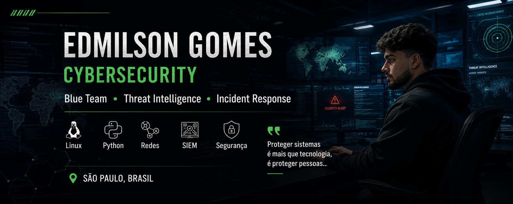
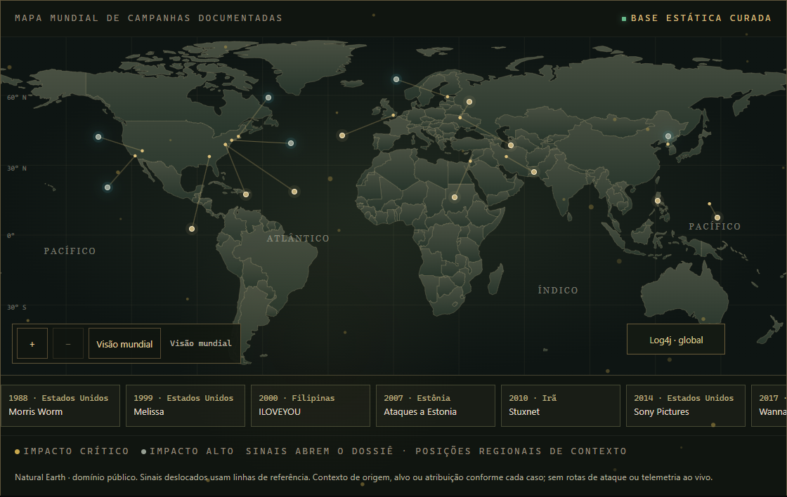
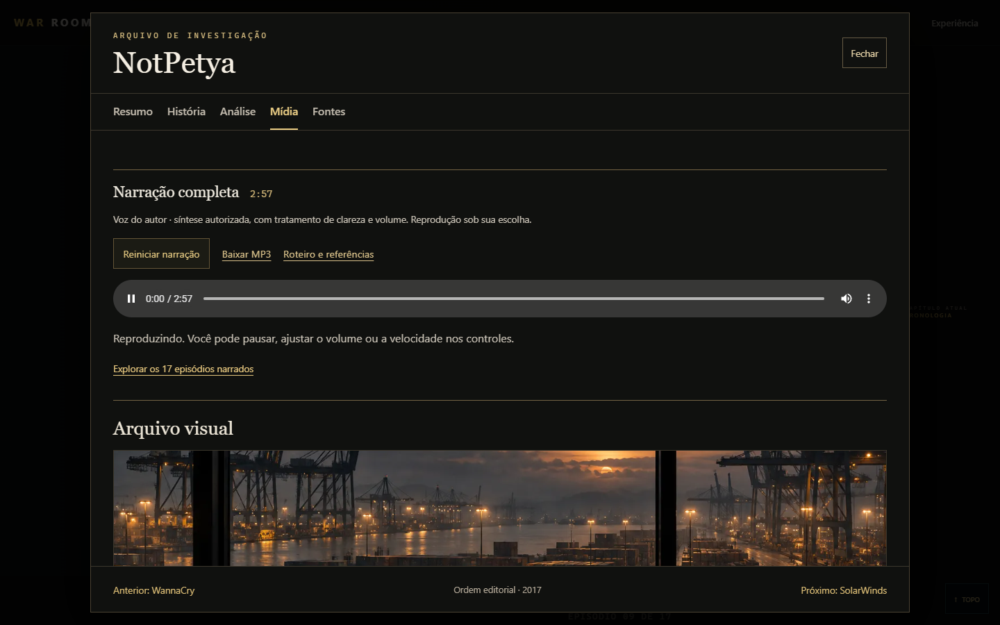
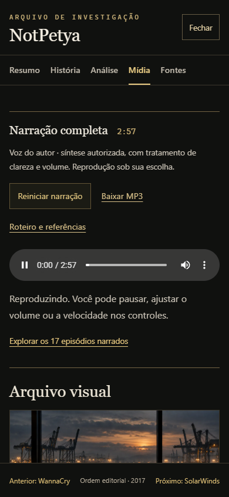
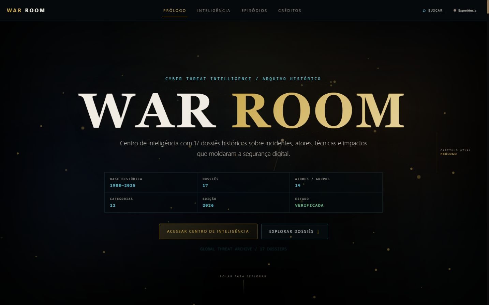
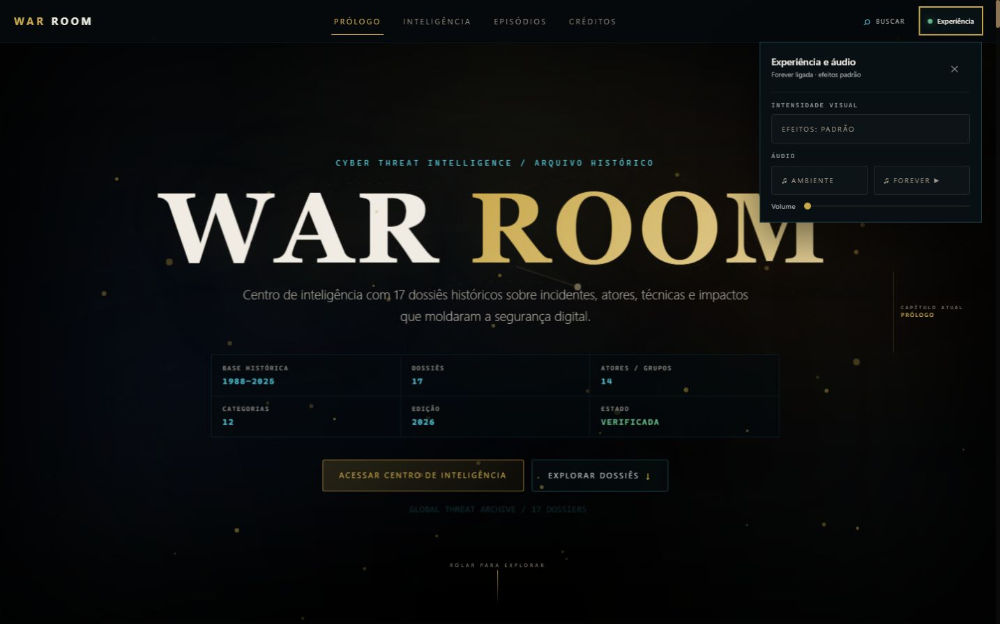
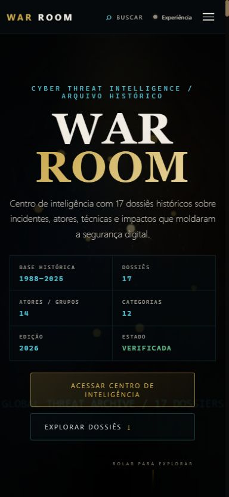
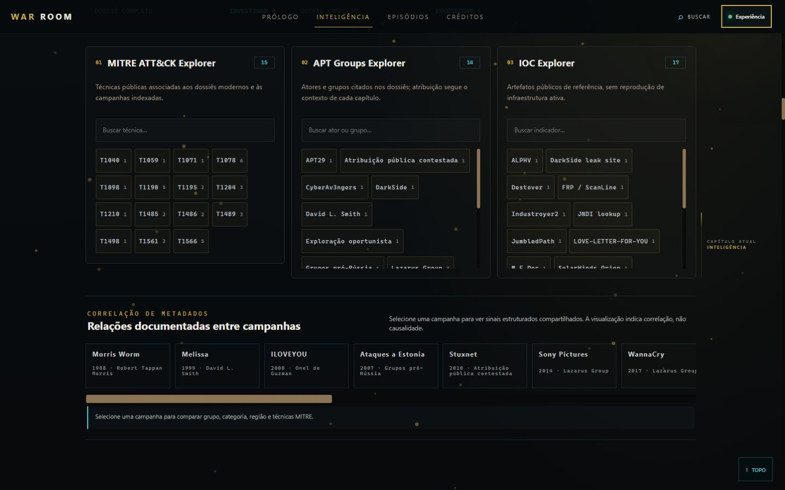
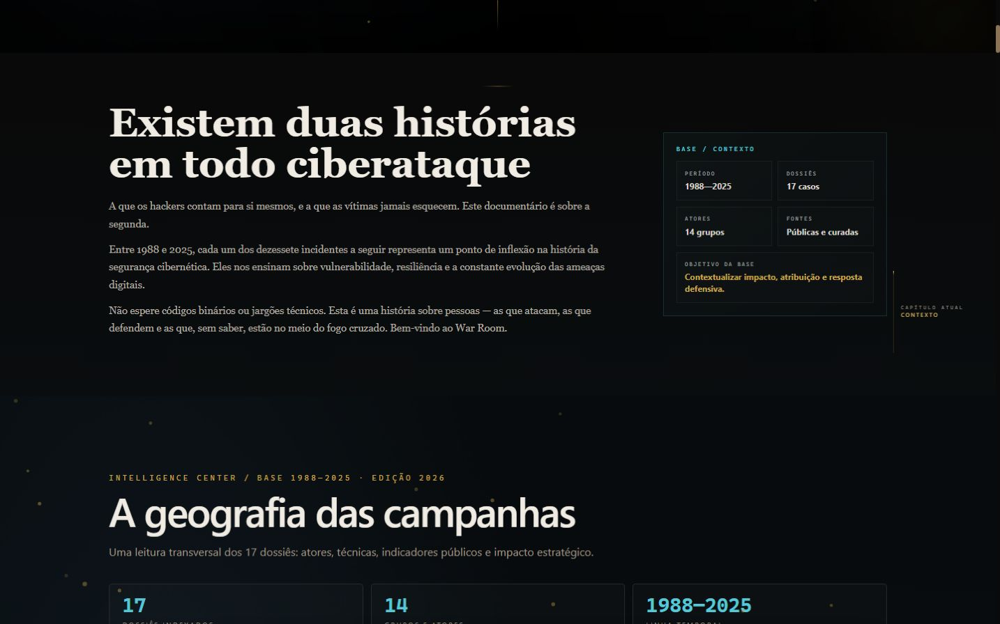
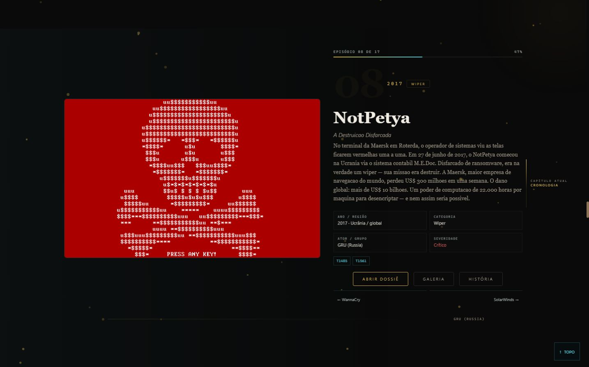

<p align="center">
  <a href="https://edy075.github.io/WAR_ROOM/"></a>
  <a href="https://github.com/EDY075/WAR_ROOM/releases/tag/v1.1.0"></a>
  
  
</p>

# WAR ROOM

## Centro de Cyber Threat Intelligence

WAR ROOM é um centro interativo de Cyber Threat Intelligence que combina narrativa histórica, inteligência de ameaças pública, investigação visual e contexto operacional. A **base histórica 1988–2025, edição 2026**, reúne 17 dossiês — do Morris Worm às campanhas modernas envolvendo Rússia × Ucrânia, Volt Typhoon, Salt Typhoon, Lazarus Group e Israel × Irã.

Criado por [Edmilson Gomes](https://github.com/EDY075) · [LinkedIn](https://linkedin.com/in/edmilson-gomes) para portfólio e pesquisa acadêmica em **Cybersecurity**, **Blue Team**, **Threat Intelligence** e **Incident Response**.

Explore a experiência completa em [edy075.github.io/WAR_ROOM](https://edy075.github.io/WAR_ROOM/).

## Edição documental · outubro de 2026

Os **17 dossiês** têm seis capítulos cada: Abertura, Origem, Propagação, Impacto, Resposta e Fontes. Um único espaço com abas reúne resumo, história, análise, mídia e referências, preservando busca, filtros, mapa, cronologia e contexto no histórico do navegador.

A [biblioteca de narrações](https://edy075.github.io/WAR_ROOM/assets/media/narrations/) oferece **17 episódios completos e 102 áudios de capítulo**, cerca de **42 minutos**, com síntese autorizada baseada na voz do autor. Áudio é opcional e carregado por escolha; cada caso mantém leitura completa e referências. A gravação pessoal de referência não integra o repositório.

Cartografia local, capas creditadas, reconstituições identificadas e controles de efeitos reduzidos compõem a experiência. NotPetya também possui capa, carrossel de cinco páginas, storyboard e teasers verticais reais em [assets/media/notpetya](assets/media/notpetya/). O teaser narrado anterior usa voz sintética padrão; as novas narrações prolongadas usam a referência aprovada do autor.



<p align="center">
  
  
</p>

Validação da edição: quatro verificadores originais, integridade dos 17 registros, navegação e 102 capítulos em desktop/mobile, galeria, teclado/foco, efeitos reduzidos e decodificação real dos 119 MP3s. Método e limitações em [EXPERIENCE_VALIDATION.md](docs/EXPERIENCE_VALIDATION.md) e [NARRATION_PRODUCTION.md](docs/NARRATION_PRODUCTION.md). Os números Lighthouse da v1.1.0 abaixo são históricos.

## Screenshots · versão anterior v1.1.0

<p align="center">
  
</p>

<p align="center">
  
  
</p>

<p align="center">
  
</p>

<p align="center">
  
  
</p>

## Principais Recursos

- 17 dossiês históricos e modernos em uma base curada de 1988–2025, edição 2026.
- Intelligence Center com visão transversal dos incidentes, atores, técnicas e indicadores.
- Busca global por título, ator, malware, país e ano, com atalhos `Ctrl/Cmd+K` e `/`.
- Mapa mundial, linha do tempo e cards sincronizados por um estado de seleção comum.
- Filtros combináveis por país, ano, categoria, impacto, grupo e malware.
- Exploradores selecionáveis de técnicas MITRE ATT&CK, grupos APT e IOCs, com contador de correspondências.
- Relações entre campanhas derivadas exclusivamente de metadados documentados, sem inferir causalidade.
- Espaço de dossiê com cinco abas, anterior/próximo e links diretos por caso, aba e capítulo.
- Cronologia aprimorada com progresso, contexto operacional, técnicas MITRE e navegação entre incidentes.
- Galeria multimídia, mapas regionais, referências e créditos visuais.
- Narrativa cinematográfica preservada em uma interface mais compacta e investigativa.
- Acessibilidade por teclado, foco gerenciado, ARIA, alvos táteis, `prefers-reduced-motion` e controle persistente de efeitos.
- Funciona sem build, backend ou instalação de dependências.

## Intelligence Center

Uma central de análise client-side que conecta os 17 dossiês por geografia, período, impacto, grupos, técnicas MITRE e indicadores públicos. Mapa, timeline, filtros, cards, exploradores e deep links compartilham o mesmo estado de seleção, permitindo navegar do panorama global ao dossiê correspondente sem sair da experiência.

O projeto é uma base histórica e educacional. Ele não declara monitoramento, telemetria ou inteligência ao vivo.

## Biblioteca de Casos

Os dossiês cobrem incidentes como Morris Worm, Melissa, ILOVEYOU, Estônia 2007, Stuxnet, Sony Pictures, WannaCry, NotPetya, SolarWinds, Colonial Pipeline, Log4Shell e MGM Resorts, além de cinco conflitos modernos: Rússia × Ucrânia, Volt Typhoon, Salt Typhoon, Lazarus Group e Israel × Irã.

As referências são apresentadas como inteligência pública, com atribuições e indicadores tratados com contexto e créditos em [assets/images/CREDITS.md](assets/images/CREDITS.md).

## Tecnologias

- HTML5, CSS3 e JavaScript nativo.
- Canvas API, Web Audio API e IntersectionObserver.
- GitHub Pages para publicação.
- [Wikimedia Commons](https://commons.wikimedia.org/) e fontes públicas de threat intelligence, incluindo [MITRE ATT&CK](https://attack.mitre.org/), [CISA](https://www.cisa.gov/), [NSA](https://www.nsa.gov/), [CERT-UA](https://cert.gov.ua/), [FBI](https://www.fbi.gov/), [NIST](https://www.nist.gov/) e [Kaspersky](https://www.kaspersky.com/resource-center).

## Qualidade da v1.1.0

Auditoria local final com Lighthouse:

| Perfil | Performance | Acessibilidade | Boas práticas | SEO | CLS | Speed Index |
| --- | ---: | ---: | ---: | ---: | ---: | ---: |
| Desktop | 100 | 100 | 100 | 100 | 0,001 | 0,7 s |
| Mobile | 96 | 100 | 100 | 100 | 0,028 | 2,2 s |

Os quatro verificadores do projeto validam os 17 dossiês, assets locais, memória técnica, README e contratos da experiência CTI. O resumo público da auditoria está em [docs/RELEASE_AUDIT_v1.1.0.md](docs/RELEASE_AUDIT_v1.1.0.md).

## Como executar

O WAR ROOM é uma aplicação estática e não requer instalação de dependências.

### Opção 1 — Abrir diretamente

O arquivo `index.html` permite leitura em navegadores modernos. Para catálogos, mapas e narrações carregados sob demanda, use HTTP (servidor local ou GitHub Pages), pois a abertura pelo sistema de arquivos pode bloquear essas requisições.

- ✅ Google Chrome
- ✅ Microsoft Edge
- ✅ Mozilla Firefox
- ✅ Brave
- ✅ Opera

### Opção 2 — Servidor local (recomendado)

Caso prefira executar através de um servidor HTTP local, use:

```powershell
python -m http.server 4173 --bind 127.0.0.1
```

Depois acesse `http://127.0.0.1:4173/`.

## Acessar online

A versão publicada está disponível em [edy075.github.io/WAR_ROOM](https://edy075.github.io/WAR_ROOM/).

Verificação local:

```powershell
node tests/verify-ai-memory.mjs
node tests/verify-final-consistency.mjs
node tests/verify-portfolio-readme.mjs
node tests/verify-cti-evolution.mjs
```

## Licença

Distribuído sob a [MIT License](LICENSE).
